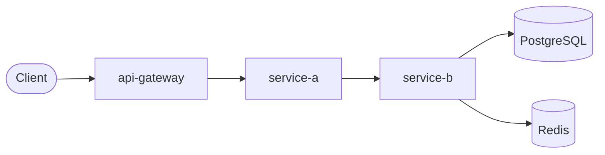

# {{PROJECT_NAME}}

{{DESCRIPTION}}

## Architecture



<!-- Replace the diagram above with the actual topology. Add frontend, worker,
     or additional dependencies as needed. Use the topologies in topologies.md
     as a reference. -->

## Services

| Service | Language / Framework | Address |
| ------- | -------------------- | ------- |
| api-gateway | {{LANG}} | `http://localhost:8080` |
| service-a | {{LANG}} | `http://localhost:8081` |
| service-b | {{LANG}} | `http://localhost:8082` |

<!-- Add or remove rows to match the actual services. Include datastores and
     other infrastructure only if they expose a port to the host. -->

## Demo Scenarios

### Golden Path

<!-- Describe the successful end-to-end request flow that the SE should walk
     through during a demo. Include the endpoints hit, the services traversed,
     and what to look for in Datadog (distributed trace, service map, logs). -->

| Step | Request | Expected Result | Datadog Signal |
| ---- | ------- | --------------- | -------------- |
| 1 | `{{METHOD}} {{ENDPOINT}}` | {{EXPECTED_RESULT}} | {{DD_SIGNAL}} |

<!-- Add rows for each step of the golden path. -->

### Failure Paths

<!-- List each intentional failure scenario built into the demo. Each failure is
     triggered by a deterministic "magic value" (product ID, coupon code, email)
     that causes the named failure every time. See failure-scenarios.md in the
     toolkit for the catalog of trigger patterns. -->

| Scenario | Trigger (API) | How to Reproduce | Expected Behavior | Datadog Signal |
| -------- | ------------- | ---------------- | ----------------- | -------------- |
| {{SCENARIO_NAME}} | {{TRIGGER}} | {{HUMAN_ACTION}} | {{BEHAVIOR}} | {{DD_SIGNAL}} |

<!-- Add rows for each failure scenario. The "How to Reproduce" column should
     describe the human-friendly action (e.g., "Add product Phantom Widget to
     cart and place the order") so a demoer can trigger it without curl. -->

<!-- AUTH:START — Include this section only when Keycloak is present. Remove
     the AUTH:START / AUTH:END markers and this comment in the final README. -->

## Authentication

### Credentials

| Username | Password | Role | Persona |
| -------- | -------- | ---- | ------- |
| `admin` | `admin` | Keycloak admin | Keycloak administration — not used in demo flows |
| `{{USER_1}}` | `{{PASSWORD}}` | {{ROLE}} | {{PERSONA_DESCRIPTION}} |
| `{{USER_2}}` | `{{PASSWORD}}` | {{ROLE}} | {{PERSONA_DESCRIPTION}} |

<!-- Add or remove rows to match the users in keycloak/realm-export.json.
     Map each user to the demo persona/narrative they represent
     (e.g., "normal customer flow", "admin/power-user flow"). -->

### Auth Endpoints

| Endpoint | URL |
| -------- | --- |
| Keycloak admin console | `http://localhost:8080/admin` |
| OIDC discovery | `http://localhost:8080/realms/{{REALM}}/.well-known/openid-configuration` |
| Token endpoint | `http://localhost:8080/realms/{{REALM}}/protocol/openid-connect/token` |
| Login page | `http://localhost:8080/realms/{{REALM}}/protocol/openid-connect/auth` |

<!-- Adjust the realm name and ports to match the project configuration. -->

<!-- AUTH:END -->

## Prerequisites

- [Docker](https://docs.docker.com/get-docker/) and [Docker Compose](https://docs.docker.com/compose/install/) v2+
- A [Datadog](https://www.datadoghq.com/) account with a valid API key
- The following environment variables exported in your shell:

| Variable | Description |
| -------- | ----------- |
| `DD_API_KEY` | Your Datadog API key |
| `DD_SITE` | Datadog site (e.g. `datadoghq.com`, `datadoghq.eu`) |

`DD_ENV` is auto-generated during scaffolding using the `{project}-{YYMMDD}` convention and is already set in `.env.example`. You do not need to export it.

## Getting Started

```bash
# 1. Copy the example env file and fill in your values
cp .env.example .env

# 2. Build and start all services (including the Datadog Agent)
make up

# 3. Tail logs to verify everything is running
make logs
```

The application will be available at `http://localhost:8080`.

## Makefile Targets

| Target | Description |
| ------ | ----------- |
| `make build` | Build all service images |
| `make up` | Build and start the full stack |
| `make down` | Stop all services |
| `make logs` | Tail logs from all services |
| `make smoke-test` | Run the smoke-test script |
| `make traffic` | Start only the traffic generator |
| `make clean` | Stop services, remove volumes and images |
